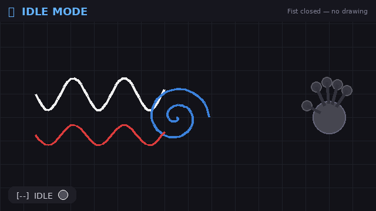

# Air Canvas 🎨🖐️

<p align="center">
  
</p>

<p align="center">
  
  
  
  
</p>

A gesture-controlled virtual whiteboard that transforms your webcam into a touchless drawing surface.

Using OpenCV and MediaPipe, Air Canvas allows users to draw, erase, move, and save digital sketches in real time using only hand gestures—no touchscreen, stylus, or additional hardware required.

---

## 🎯 Motivation

Traditional digital drawing tools require physical input devices such as a mouse, touchscreen, or stylus.

Air Canvas explores a more natural form of human-computer interaction by using computer vision and hand tracking to turn free-hand gestures into digital ink. The project serves as both a practical application of real-time computer vision and an experiment in touchless interfaces.

---

## ✨ Features

|            Fingers | Mode              | Description                                        |
| -----------------: | ----------------- | -------------------------------------------------- |
|           0 (Fist) | **Idle**          | Temporarily disables all drawing actions           |
|          1 (Index) | **Draw**          | Draws continuous strokes using the index fingertip |
| 2 (Index + Middle) | **Drag**          | Moves the entire canvas using a pinch-like gesture |
|                  3 | **Color Palette** | Select a drawing color from the on-screen palette  |
|                  4 | **Snapshot**      | Saves the current canvas as a PNG image            |
|      5 (Open Hand) | **Wipe Eraser**   | Erases content beneath the detected hand region    |

### Additional Features

* Real-time hand tracking
* Smooth stroke interpolation
* Canvas dragging and repositioning
* Color palette switching
* Snapshot saving with anti-spam cooldown
* Multi-hand detection and safety lock
* Modular project architecture
* Config-driven customization
* Unit tests for core components

---

## 📸 Screenshots

### Drawing Mode


### Color Palette


### Eraser Mode


---

## 🧰 Tech Stack

| Component            | Technology  |
| -------------------- | ----------- |
| Language             | Python 3.7+ |
| Computer Vision      | OpenCV      |
| Hand Tracking        | MediaPipe   |
| Numerical Processing | NumPy       |
| Testing              | PyTest      |

---

## 🏗️ Architecture

```text
Webcam Feed
     │
     ▼
OpenCV Frame Capture
     │
     ▼
MediaPipe Hand Tracker
     │
     ▼
Landmark Extraction
     │
     ▼
Gesture Engine
     │
     ├── Draw
     ├── Drag
     ├── Erase
     ├── Snapshot
     └── Color Selection
     │
     ▼
Canvas Renderer
     │
     ▼
Frame Compositor
     │
     ▼
Final Output Window
```

---

## 📁 Project Structure

```text
air_canvas/
├── main.py
├── requirements.txt
├── README.md
├── .gitignore
├── LICENSE
│
├── core/
│   ├── hand_tracker.py
│   ├── gesture_engine.py
│   └── canvas_renderer.py
│
├── ui/
│   ├── color_palette.py
│   ├── hud_overlay.py
│   ├── eraser_box.py
│   └── multi_hand_warn.py
│
├── utils/
│   ├── compositing.py
│   ├── smoothing.py
│   ├── snapshot.py
│   └── finger_counter.py
│
├── config/
│   ├── settings.py
│   ├── colors.py
│   ├── gestures.py
│   └── camera.py
│
├── assets/
│   ├── icons/
│   ├── fonts/
│   └── snapshots/
│
├── tests/
│   ├── test_gestures.py
│   ├── test_compositing.py
│   └── test_snapshot.py
│
└── docs/
    ├── architecture.md
    ├── gesture_guide.md
    └── demo.gif
```

---

## 🧠 How It Works

### Hand Tracking

MediaPipe detects and tracks 21 three-dimensional landmarks for each hand.

The system determines whether a finger is extended or folded by comparing the position of the fingertip with its lower joint.

```text
Tip above joint   → Finger extended
Tip below joint   → Finger folded
```

The number of extended fingers determines the active interaction mode.

---

### Gesture Recognition

```text
0 Fingers → Idle
1 Finger  → Draw
2 Fingers → Drag Canvas
3 Fingers → Color Selection
4 Fingers → Save Snapshot
5 Fingers → Erase
```

A second detected hand automatically pauses all interactions to prevent accidental input.

---

### Rendering Pipeline

The application maintains two separate layers:

1. Live webcam feed
2. Virtual drawing canvas

The webcam frame is mirrored horizontally to provide a more intuitive user experience.

---

### Compositing

Each frame is merged with the drawing canvas using OpenCV bitwise operations.

```python
mask = cv2.bitwise_and(canvas, canvas, mask=gray_canvas)

frame_cut = cv2.bitwise_and(
    frame,
    frame,
    mask=cv2.bitwise_not(gray_canvas)
)

output = cv2.bitwise_or(frame_cut, mask)
```

This creates the illusion that the digital ink exists directly within the live camera feed.

## 🤝 Contributing

Contributions are welcome and appreciated.

Whether you'd like to fix a bug, improve performance, add a feature, enhance documentation, or improve the user interface, feel free to contribute.

### Getting Started

1. Fork the repository.
2. Clone your fork locally.

```bash
git clone https://github.com/your-username/air_canvas.git
cd air_canvas
```

3. Create a new branch for your changes.

```bash
git checkout -b feature/your-feature-name
```

4. Make your changes and ensure the project runs correctly.

5. Run tests before submitting.

```bash
pytest tests/
```

6. Commit your changes with a clear commit message.

```bash
git commit -m "Add gesture smoothing improvement"
```

7. Push your branch.

```bash
git push origin feature/your-feature-name
```

8. Open a Pull Request describing:

   * What changed
   * Why it was changed
   * Any relevant screenshots or demonstrations

---

### Contribution Guidelines

* Keep code modular and maintainable.
* Follow the existing project structure.
* Avoid introducing unnecessary dependencies.
* Add comments only where they improve clarity.
* Update documentation when adding or changing features.
* Include tests for new functionality whenever possible.

---

### Reporting Bugs

If you discover a bug, please open an issue and include:

* Operating system
* Python version
* Steps to reproduce
* Expected behavior
* Actual behavior
* Screenshots or logs (if applicable)

---

### Feature Requests

Feature suggestions are welcome.

When submitting a feature request, try to explain:

* The problem it solves
* The proposed solution
* Potential implementation ideas

---

### First-Time Contributors

Good areas for first contributions include:

* Documentation improvements
* UI enhancements
* Additional tests
* Performance optimizations
* New gesture modes
* Bug fixes

Every contribution, no matter how small, helps improve the project.


---

## ⚙️ Configuration

All tunable values are centralized inside the `config/` directory.

| File        | Purpose                                  |
| ----------- | ---------------------------------------- |
| settings.py | Camera index, cooldowns, window settings |
| colors.py   | Drawing palette definitions              |
| gestures.py | Finger count to action mappings          |
| camera.py   | Resolution presets                       |

No magic numbers are hardcoded throughout the application logic.

---

## 🚀 Installation

### Clone Repository

```bash
git clone https://github.com/your-username/air_canvas.git

cd air_canvas
```

### Create Virtual Environment

```bash
python -m venv .venv
```

Activate:

**Linux / macOS**

```bash
source .venv/bin/activate
```

**Windows**

```bash
.venv\Scripts\activate
```

### Install Dependencies

```bash
pip install -r requirements.txt
```

### Run

```bash
python main.py
```

Press **Esc** to exit.

---

## 🧪 Running Tests

Install PyTest:

```bash
pip install pytest
```

Run:

```bash
pytest tests/
```

---

## 📸 Snapshots

Raise four fingers to save the current canvas.

Snapshots are stored inside:

```text
assets/snapshots/
```

Filename format:

```text
snapshot_YYYYMMDD_HHMMSS.png
```

A cooldown mechanism prevents repeated accidental saves.

---

## ⚡ Performance Notes

Performance depends on camera resolution and hardware.

Typical usage on a modern laptop:

* 25–40 FPS
* Low-latency gesture response
* Real-time rendering at 720p

For best results:

* Use a well-lit environment
* Keep only one hand visible
* Position your hand within the camera frame

---

## 🧩 Challenges Solved

* Reducing hand landmark jitter
* Preventing accidental gesture activation
* Maintaining smooth strokes in real time
* Handling multiple hands safely
* Efficient frame compositing for real-time performance

---

## 🔮 Future Improvements

* Undo / Redo functionality
* Shape drawing tools
* Text insertion support
* Gesture customization
* Multi-user collaboration
* Stroke thickness controls
* Session persistence
* Touchless presentation mode

---

## 📄 License

Distributed under the MIT License.

See the `LICENSE` file for details.
